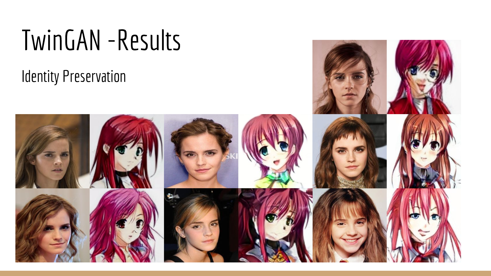
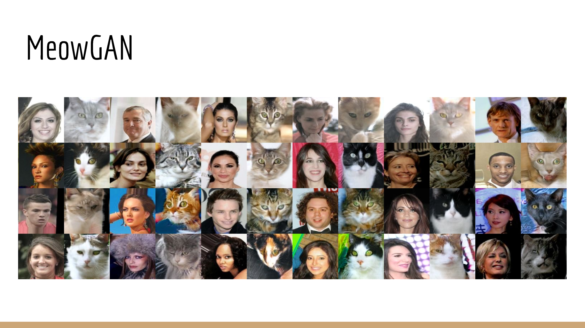

# TwinGAN -- Unsupervised Image Translation for Human Portraits

## Use Pretrained Model.

For a pretrained model (Human to anime), you can download it [here](https://drive.google.com/open?id=1dXfqAODQxB2uNhyQANtZICAjwhNMWnbl)

For a pretrained model (Human to cat), you can download it [here](https://drive.google.com/open?id=1UJEqlH_1sfdmWs6MXKV4H69NGad0rdUB)

Unzip and put the content directly in the root directory of the project

## installation.

For this project you will need a python3 version.

You will need the following package:
    
    sudo apt install python3
    sudo apt install virtualenv
    sudo apt install python3-pip
    sudo apt install python3-tk
    sudo apt install cmake
    
Install rabbit mq:

    sudo apt install rabbitmq-server
 
Prepare your virtualenv:

    virtualenv venv
    . venv/bin/activate
    pip install -r requirements.txt   

If you want to exit your virtualenv:

    deactivate
    
    
## Rabbit mq configuration

To able connect to the rabbit mq server remotly you will need to creat a file 

    rabbitmq.config

in the tha rabbit mq path

    Generic UNIX - $RABBITMQ_HOME/etc/rabbitmq/
    Debian - /etc/rabbitmq/
    RPM - /etc/rabbitmq/
    Mac OSX (Homebrew) - ${install_prefix}/etc/rabbitmq/, the Homebrew prefix is usually /usr/local
    Windows - %APPDATA%\RabbitMQ\
    
And add this line  

    [{rabbit, [{loopback_users, []}]}].
    
Restart rabbit mq.

## Launch

Now you can launch the server just with this command? **Remember to activate your virtualenv**

    python server.py <ip>

## Original git repository

You can found the original project [here](https://github.com/jerryli27/TwinGAN):

## Troubleshooting

If you have any issue regarding the install/deployment of the engine,
first check the version of pip

    pip -V

If it's lower than 8.0 then you must upgrade it

    pip install --upgrade pip

If you have a low version of pip it's probably because you have a low version of virtualenv as well.

Upgrade your virtualenv to at least be at the 15.0 version

    sudo pip install virtualenv --upgrade

If you get an error related to subprocess32, you will need to install python-dev

    sudo apt install python-dev
    
## Disclaimer

This personal project is developed and open sourced when I am working for Google, therefore you see Copyright 2018 Google LLC in each file. This is not an officially supported Google product. See [License](LICENSE) and [Contributing](CONTRIBUTING.md) for more details.
